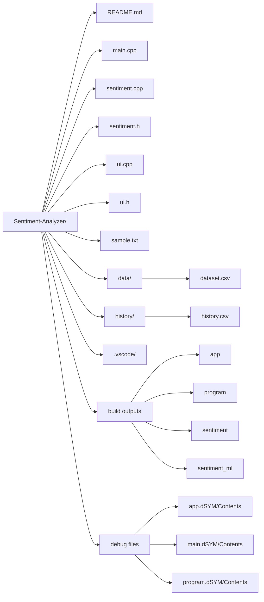

# 🧠 Sentiment Analyzer (C++ / OOP Project)

## 🔍 Project Overview
This project implements a **Sentiment Analysis System** in C++ using Object-Oriented Programming principles and a custom-built **Naive Bayes Machine Learning model**.  
It allows users to analyze text and classify it into **Positive, Negative, or Neutral** sentiments.

> Designed as a modular, lightweight, and educational machine learning system built entirely from scratch in C++.

---

## ✨ Key Features
- ✅ Sentiment classification (Positive / Negative / Neutral)
- ✅ Naive Bayes Machine Learning model
- ✅ Custom tokenization and vocabulary building
- ✅ Training from CSV dataset
- ✅ Interactive terminal-based UI
- ✅ History tracking of analyzed inputs
- ✅ CSV export of results
- ✅ Modular OOP-based structure
- ✅ No external libraries required

---

## 🌐 System Architecture

    +----------------------+
    |      User Input      |
    +----------+-----------+
               |
               v
    +----------------------+
    |   Text Processing    |
    | (Tokenization)       |
    +----------+-----------+
               |
               v
    +----------------------+
    |  Naive Bayes Model   |
    |  (Training + Predict)|
    +----------+-----------+
               |
               v
    +----------------------+
    |   Sentiment Output   |
    +----------+-----------+
               |
               v
    +----------------------+
    |   History Storage    |
    +----------------------+

---

## 🛠️ Technologies Used

- C++
- Object-Oriented Programming (OOP)
- Standard Template Library (STL)
- File Handling (CSV)
- Machine Learning (Naive Bayes)

---

## 📂 Project Structure


---

## ⚙️ Requirements
- C++17 or higher
- g++ compiler (MinGW / GCC / Clang)
- No external libraries required

---

## ⚙️ Compilation
```
    g++ src/main.cpp src/ui.cpp src/sentiment.cpp -o sentiment
```
---

## 🚀 Execution
```
    ./sentiment
```
---

## 📊 Dataset Format
```
    text,label
    I love this product,pos
    This is terrible,neg
    It is okay,neu
```
---

## 🤖 Machine Learning Details

### Naive Bayes Model
- Uses probabilistic classification
- Applies Laplace smoothing
- Computes prior and conditional probabilities

### Formula:
```
    P(label | text) ∝ P(label) × Π P(word | label)
```
- Log probabilities are used to prevent underflow.

---

## 🔄 Workflow

1. Load dataset from CSV file  
2. Train model (build vocabulary + probabilities)  
3. Take user input  
4. Tokenize input text  
5. Predict sentiment using Naive Bayes  
6. Store result in history  
7. Export results if needed  

---

## 📁 History & Export

- All analyzed inputs are stored during runtime  
- Export command saves data to:
```
    history/history.csv
```
---

## ⚠️ Limitations

- Does not handle sarcasm or complex language  
- Limited vocabulary compared to real NLP systems  
- Accuracy depends on dataset quality  
- No deep learning or contextual understanding  

---

## 🔮 Future Enhancements

- 🤖 Integration with local AI models (e.g., Ollama)  
- 🧠 Self-learning system (user feedback → dataset update)  
- 🔄 Automatic retraining of model  
- 📈 Improved confidence scoring system  
- 🌍 Multi-language support  
- 📊 Data visualization (graphs & charts)  
- 🖥️ GUI-based interface  
- 🌐 API or web-based deployment  

---

## 👥 Users

- Students and learners of Machine Learning  
- Developers experimenting with NLP  
- Researchers  
- General users

## 👨‍💻 Team Members

- Muhammad Awais Malik
- Salman Faisal

---

## ⭐ Notes

This project demonstrates how Machine Learning concepts like Naive Bayes can be implemented from scratch using C++ and OOP principles.

---

> ⚠️ This project is developed for academic purposes and demonstrates the application of OOP concepts in building an intelligent system.