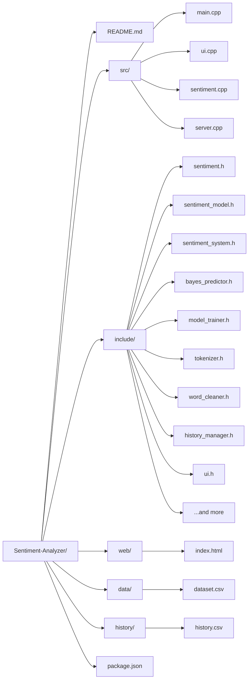

# 🧠 Sentiment Analyzer (C++ / OOP Project)

## 🔍 Project Overview
This project implements a **Sentiment Analysis System** in C++ using Object-Oriented Programming principles and a custom-built **Naive Bayes Machine Learning model**.  
It allows users to analyze text and classify it into **Positive, Negative, or Neutral** sentiments through both a terminal interface and a modern web application.

The system includes a REST API server for programmatic access, AI integration via Ollama for enhanced analysis, and self-learning capabilities through user feedback and automatic retraining.

---

## ✨ Key Features
- ✅ Sentiment classification (Positive / Negative / Neutral)
- ✅ Naive Bayes Machine Learning model with confidence scoring
- ✅ Custom tokenization, vocabulary building, and text preprocessing
- ✅ Training from CSV dataset with automatic retraining
- ✅ Interactive terminal-based UI
- ✅ Modern web-based interface with real-time analysis
- ✅ REST API server with multiple endpoints
- ✅ AI integration via Ollama proxy for advanced analysis
- ✅ Self-learning system (user feedback → dataset update → retraining)
- ✅ History tracking and CSV export of analyzed inputs
- ✅ Model accuracy testing and reporting
- ✅ Out-of-vocabulary detection and handling
- ✅ Keyword extraction for sentiment insights
- ✅ Modular OOP-based structure
- ✅ No external libraries required (pure C++ STL)

---

## 🌐 System Architecture

    +----------------------+
    |   Web Interface      |
    |   (HTML/CSS/JS)      |
    +----------+-----------+
               |
               v
    +----------------------+
    |     REST API Server  |
    |   (C++ HTTP Server)  |
    +----------+-----------+
               |
               v
    +----------------------+
    |   Text Processing    |
    | (Tokenization/Cleaning|
    +----------+-----------+
               |
               v
    +----------------------+
    |  Naive Bayes Model   |
    |  (Training + Predict)|
    +----------+-----------+
               |
               v
    +----------------------+
    |   AI Enhancement     |
    |   (Ollama Proxy)     |
    +----------+-----------+
               |
               v
    +----------------------+
    |   Sentiment Output   |
    +----------+-----------+
               |
               v
    +----------------------+
    |   Self-Learning      |
    | (Feedback + Retrain) |
    +----------+-----------+
               |
               v
    +----------------------+
    |   History Storage    |
    +----------------------+

---

## 🛠️ Technologies Used

- C++
- Object-Oriented Programming (OOP)
- Standard Template Library (STL)
- HTTP Server (Socket Programming)
- JSON for API communication
- File Handling (CSV)
- Machine Learning (Naive Bayes)
- Web Technologies (HTML/CSS/JavaScript)
- AI Integration (Ollama API)

---

## 📂 Project Structure


---

## ⚙️ Requirements
- C++17 or higher
- g++ compiler (MinGW / GCC / Clang)
- Modern web browser (for web interface)
- Ollama (optional, for AI features)
- No external libraries required

---

## ⚙️ Compilation

### Terminal Application
```
    cd ..
      g++ -std=c++17 -O2 -Iinclude -o server src/server.cpp src/sentiment.cpp -pthread
      ./server
```

### REST API Server
```
g++ -std=c++17 -O2 -Iinclude -o server src/server.cpp src/sentiment.cpp -pthread
```
---

## 🚀 Execution

### Terminal Application
```
./sentiment
```

### REST API Server
```
./server
```
The server runs on `http://localhost:8080` by default.

### Web Interface
Open `web/index.html` in your browser, or serve it via the API server.

---

## 🌐 API Endpoints

The REST API server provides the following endpoints:

- `GET /ping` - Health check
- `GET /accuracy` - Model accuracy on dataset
- `GET /dataset-info` - Dataset statistics
- `GET /model-info` - Model information (accuracy, vocab size, etc.)
- `POST /predict` - Sentiment prediction with confidence and keywords
- `GET /history` - All prediction history
- `POST /teach` - Add user feedback to dataset
- `POST /retrain` - Retrain model with updated dataset
- `POST /ollama-proxy` - AI-enhanced analysis via Ollama

All endpoints return JSON responses with CORS headers enabled.
---

## 📊 Dataset Format
```
    text,label
    I love this product,pos
    This is terrible,neg
    It is okay,neu
```
---

## 🤖 Machine Learning Details

### Naive Bayes Model
- Uses probabilistic classification
- Applies Laplace smoothing
- Computes prior and conditional probabilities

### Formula:
```
    P(label | text) ∝ P(label) × Π P(word | label)
```
- Log probabilities are used to prevent underflow.

---

## 🔄 Workflow

### Terminal Mode
1. Load dataset from CSV file  
2. Train model (build vocabulary + probabilities)  
3. Take user input via terminal  
4. Tokenize and preprocess input text  
5. Predict sentiment using Naive Bayes  
6. Display result with confidence and keywords  
7. Store result in history  
8. Export results if needed  

### Web/API Mode
1. Start REST API server  
2. Access web interface or use API endpoints  
3. Submit text for analysis  
4. Server processes text through ML model  
5. Optional: Enhance with AI via Ollama  
6. Return sentiment with confidence, keywords, OOV detection  
7. User can provide feedback to teach the system  
8. Automatic retraining updates the model  
9. History accessible via API  

---

## 📁 History & Export

- All analyzed inputs are stored during runtime  
- Export command saves data to:
```
    history/history.csv
```
---

## ⚠️ Limitations

- Does not handle sarcasm or highly complex language patterns  
- Limited vocabulary compared to large-scale NLP systems  
- Accuracy depends on dataset quality and size  
- No deep learning or advanced contextual understanding  
- AI enhancement requires external Ollama service  
- Self-learning is incremental and may require multiple feedback cycles  
- Web interface is client-side only (no backend processing in browser)  

---

## 🔮 Future Enhancements

- 📊 Advanced data visualization (charts, graphs, analytics dashboard)  
- 🌍 Multi-language support with translation integration  
- 🔄 Real-time model updates and continuous learning  
- 📱 Mobile web interface  
- ☁️ Cloud deployment and API scaling  
- 🤖 Enhanced AI integration with multiple models  
- 🎯 Domain-specific sentiment analysis (e.g., product reviews, social media)  
- 🔒 User authentication and personalized models  
- 📈 Performance optimization and model compression  
- 🧪 A/B testing framework for model improvements  

---

## 👥 Users

- Students and learners of Machine Learning  
- Developers experimenting with NLP  
- Researchers  
- General users

## 👨‍💻 Team Members

- Muhammad Awais Malik
- Salman Faisal

---

## ⭐ Notes

This project demonstrates how Machine Learning concepts like Naive Bayes can be implemented from scratch using C++ and OOP principles.

---

> ⚠️ This project is developed for academic purposes and demonstrates the application of OOP concepts in building an intelligent system.